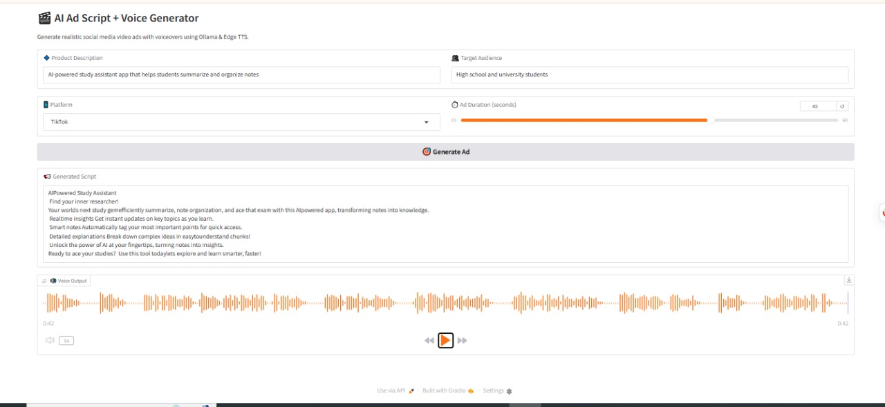

# 🎬 AI Ad Script & Voice Generator

This project is an AI-powered tool that automatically generates short, engaging **social media ad scripts** and converts them into **realistic voiceovers**. Perfect for platforms like **TikTok**, **Instagram Reels**, or **YouTube Shorts**.

> 💡 Built with [DeepSeek LLM](https://huggingface.co/deepseek-ai) via [Ollama](https://ollama.com/), Microsoft’s Edge TTS, and Gradio UI.

---

## 🚀 Features

✅ Generate compelling video ad scripts using DeepSeek (1.5B)  
✅ Converts text into speech with Edge TTS (e.g., en-US-AriaNeural)  
✅ Interactive web UI using Gradio  
✅ Automatically splits long texts for smoother voice output  
✅ One-click Google Colab demo  
✅ Clean and structured outputs: Text + Audio

---

## 📸 Demo



🎧 Listen to a sample output:  
[🔊 Sample Voice Output (MP3)](assets/sample-voice.mp3)

---

## 🔧 Technologies Used

| Component            | Purpose                             |
|----------------------|-------------------------------------|
| **Ollama**           | Local LLM backend for inference     |
| **DeepSeek 1.5B**    | Language model to generate scripts  |
| **Edge-TTS**         | Microsoft Text-to-Speech            |
| **Gradio**           | Web user interface                  |
| **Python (asyncio, regex)** | Script logic and text processing |
| **pydub**            | Merge multiple audio segments       |

---

## 📦 Installation

### 1. Clone the repo

```bash
git clone https://github.com/YOUR_USERNAME/ai-ad-script-voice-generator.git
cd ai-ad-script-voice-generator
```
---
### 2. Install Python dependencies
```bash
pip install -r requirements.txt
```
---
### 3. Start Ollama and Pull the Model
**⚠️ Make sure Ollama is installed and running.**
```bash
ollama serve &
ollama pull deepseek-r1:1.5b
```
---
## ▶️ Run the App
```bash
python app.py
```
- Then open the Gradio interface in your browser.
---
## ✍️ **How It Works**
### 1. Generate Script
- The model generates a punchy ad script based on:

-**Product description**

-**Target audience**

-**Platform (TikTok, Instagram, etc.)**

-**Duration in seconds (estimated word count)**

### **2. Convert to Speech**
-**The script is cleaned (removing <tags>, emojis, hashtags).**

-**Long text is split into chunks (~350 characters).**

-**Each chunk is passed to Edge TTS (Microsoft).**

-**All audio chunks are merged into one .mp3.**

---
## 📁 **Project Structure**
```bash
📁 ai-ad-script-voice-generator/
│
├── app.py                 # Main Gradio interface
├── requirements.txt       # Python dependencies
├── README.md              # This file
├── assets/                # UI screenshots, sample audio
└── notebooks/
    └── colab_demo.ipynb   # Google Colab version (optional)
```
---
## **🔄 Requirements**
```bash
gradio
edge-tts
ollama
pydub
```
You can install all of them with:
```bash
pip install -r requirements.txt
```
---
## **🌍 Multi-language Support (Coming Soon)**
 - Arabic Ad Script & Voice (using ar-EG-SalmaNeural)

 - Translation option (English ↔ Arabic)

 - Downloadable MP3 output

---
## **📄 License**
- This project is licensed under the MIT License — feel free to use, modify, and share!
---
## **🙌 Acknowledgments**
* DeepSeek Model

* Ollama

* Microsoft Edge TTS

* Gradio

---
